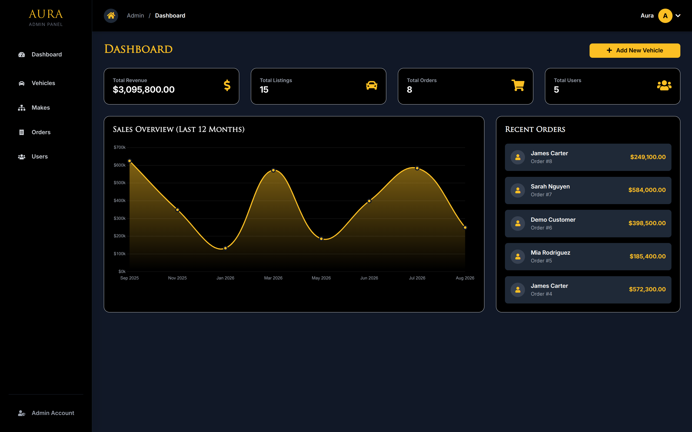

# AuraEdition 🚗✨

[](https://opensource.org/licenses/MIT)
[](https://www.php.net/)
[](https://www.mysql.com/)
[](https://tailwindcss.com/)

> **A premium e-commerce platform for luxury vehicles.**
> 
> Modern, secure, and scalable. Built for car enthusiasts, dealers, and admins.

## 🌐 Live Demo
**Visit the live application:** [https://auraedition.wuaze.com](https://auraedition.wuaze.com)
</br>
(Some Features might not work due to free server limitations)

## Screenshots
<details>
  <summary>Click to view screenshots</summary>
  
  ### Home Page
  
  
  ### Product Listings
   
  
  ### Product Details
  
  
  ### Shopping Cart
  

  ### Checkout Page
   
  
  ### Admin Dashboard
  
  
  ### Product Management
  

  ### User Account
  
  
  ### Order History
  
</details>

## Table of Contents
- [AuraEdition](#auraedition-)
  - [Live Demo](#-live-demo)
  - [Screenshots](#screenshots)
  - [Table of Contents](#table-of-contents)
  - [Introduction](#introduction)
  - [Features](#features)
  - [Technologies Used](#technologies-used)
  - [Installation](#installation)
  - [Usage](#usage)
  - [Contributing](#contributing)
  - [License](#license)
  - [Contact](#contact)

## Introduction
AuraEdition is a premium e-commerce platform specifically designed for luxury vehicle sales. It provides a modern, secure, and scalable solution for car dealers, enthusiasts, and administrators. The platform features a comprehensive admin panel, user authentication, shopping cart functionality, and a responsive design built with Tailwind CSS.

## Features

### 🛒 E-commerce Core
- **Product Catalog**: Luxury vehicle listings with search, filters, and pagination
- **Shopping Cart**: Add/remove items, quantity management, cart persistence
- **Wishlist**: Save favorite vehicles for later
- **Checkout System**: Secure payment processing with order management
- **Order History**: Track purchases and order status

### 👤 User Management
- **Authentication**: Secure registration, login, and password reset
- **User Profiles**: Account management with address storage
- **Role-Based Access**: User and admin roles with appropriate permissions

### 🎛️ Admin Panel
- **Dashboard Analytics**: Revenue tracking, sales charts, key metrics
- **Product Management**: Add, edit, delete vehicles with image uploads
- **Category Management**: Manage vehicle makes and models
- **Order Management**: View, update, and track all orders
- **User Management**: Administer user accounts and roles

### 🎨 User Experience
- **Responsive Design**: Mobile-first approach with Tailwind CSS
- **Modern UI**: Luxury aesthetic with premium styling
- **Interactive Elements**: AJAX-powered features for smooth UX
- **Search & Filters**: Advanced vehicle discovery

### 🔒 Security Features
- **CSRF Protection**: Token-based form security
- **Input Validation**: Comprehensive data sanitization
- **Password Security**: Bcrypt hashing with salt
- **Session Management**: Secure user sessions
- **SQL Injection Prevention**: Prepared statements throughout

## Technologies Used

- **PHP 7.4+**: Backend server-side scripting with procedural programming
- **MySQL 5.7+**: Relational database management with InnoDB engine
- **HTML5**: Semantic markup for web pages
- **CSS3**: Advanced styling with Tailwind CSS framework
- **JavaScript (ES6+)**: Client-side interactivity and AJAX requests
- **Tailwind CSS**: Utility-first CSS framework for modern UI design
- **Font Awesome**: Icon library for UI elements
- **Chart.js**: JavaScript charting library for admin analytics
- **PHPMailer**: Email functionality for password reset and notifications

<p align="left">
  <a href="https://skillicons.dev">
    
  </a>
</p>

## Installation

To get a local copy up and running, follow these steps:

### Prerequisites
- **Web Server**: Apache/Nginx with PHP support
- **PHP**: 7.4 or higher with mysqli extension
- **MySQL**: 5.7 or higher
- **Node.js**: 14+ (for Tailwind CSS compilation)
- **Composer**: (optional, for dependency management)

### Installation Steps

1. **Clone the repository**:
   ```sh
   git clone https://github.com/yourusername/auraedition.git
   cd auraedition
   ```

2. **Install Node.js dependencies**:
   ```sh
   npm install
   ```

3. **Build Tailwind CSS**:
   ```sh
   npx tailwindcss -i ./assets/css/input.css -o ./assets/css/tailwind-output.css --minify
   ```

4. **Configure Database**:
   ```sh
   # Create database
   mysql -u root -p
   CREATE DATABASE auraedition;
   
   # Import schema (if available)
   mysql -u root -p auraedition < database/schema.sql
   ```

5. **Configure Application**:
   ```sh
   # Edit database configuration
   nano config/config.php
   
   # Update these values:
   define('DB_HOST', 'localhost');
   define('DB_USER', 'your_username');
   define('DB_PASS', 'your_password');
   define('DB_NAME', 'auraedition');
   ```

6. **Set Permissions**:
   ```sh
   # Ensure upload directories are writable
   chmod 755 products/img/
   chmod 755 admin/assets/images/
   ```

7. **Start Development Server**:
   ```sh
   # Using PHP built-in server
   php -S localhost:8000
   
   # Or configure your web server (Apache/Nginx)
   ```

## Usage

### For Users
1. **Browse Products**: Visit the home page to see featured vehicles
2. **Search & Filter**: Use the search bar and filters to find specific vehicles
3. **Add to Cart**: Click "Add to Cart" on any vehicle to add it to your shopping cart
4. **Manage Wishlist**: Save vehicles to your wishlist for later viewing
5. **Checkout**: Complete your purchase through the secure checkout process
6. **Track Orders**: View your order history and track current orders

### For Administrators
1. **Access Admin Panel**: Login with admin credentials at `/admin/`
2. **Dashboard Overview**: View sales analytics and key metrics
3. **Manage Products**: Add, edit, or delete vehicle listings
4. **Handle Orders**: Process and update order statuses
5. **User Management**: Administer user accounts and roles
6. **Category Management**: Manage vehicle makes and models

### Environment Configuration

The application uses a centralized configuration system:

- **`config/config.php`**: Database credentials, paths, and constants
- **`includes/bootstrap.php`**: Application initialization and dependencies
- **Error Logging**: Check `error_log.txt` for debugging

## Contributing

Contributions are welcome! Follow these steps to contribute:

1. Fork the repository.
2. Create a new branch:
   ```sh
   git checkout -b feature/your-feature-name
   ```
3. Make your changes and commit them:
   ```sh
   git commit -m 'Add some feature'
   ```
4. Push to the branch:
   ```sh
   git push origin feature/your-feature-name
   ```
5. Open a pull request.

### Development Workflow

#### Adding New Features

1. **Database Changes**
   ```sql
   -- Add new tables/columns
   ALTER TABLE vehicles ADD COLUMN new_field VARCHAR(255);
   ```

2. **Backend Functions**
   ```php
   // Add to includes/functions.php or admin/includes/adminFunctions.php
   function newFeature($connection, $params) {
       // Implementation
   }
   ```

3. **Frontend Integration**
   ```javascript
   // Add to assets/js/script.js or admin/assets/js/adminScript.js
   function handleNewFeature() {
       // AJAX calls and UI updates
   }
   ```

## License

This project is licensed under the MIT License. See the [LICENSE](LICENSE) file for details.

## Contact

For any questions or feedback, feel free to reach out:

- **Email**: [your-email@example.com](mailto:your-email@example.com)
- **GitHub**: [your-github-username](https://github.com/your-github-username)

---

## 📚 Additional Documentation

### Core Documentation
- **[Architecture Guide](docs/architecture.md)**: System design, data flow, and component interactions
- **[Database Schema](docs/database.md)**: Table structures, relationships, and optimization
- **[Security Model](docs/security.md)**: Authentication, validation, and security practices
- **[Developer Guide](docs/developer_guide.md)**: Coding standards, workflow, and troubleshooting

### Module Documentation
- **[Modules Overview](docs/modules.md)**: Directory structure and purpose of each module
- **[API Planning](docs/api.md)**: Future REST API endpoints and integration

### Quick References
- **File Structure**: See project layout in the main documentation
- **Database Tables**: See `docs/database.md`
- **Function Reference**: See `includes/functions.php` and `admin/includes/adminFunctions.php`

---

## 🛠️ Troubleshooting

### Common Issues

1. **Database Connection Error**
   - Check `config/config.php` credentials
   - Verify MySQL service is running
   - Check error logs in `error_log.txt`

2. **AJAX/JSON Errors**
   - Ensure process scripts return valid JSON
   - Check browser console for JavaScript errors
   - Verify CSRF tokens on forms

3. **Image Upload Issues**
   - Check directory permissions (755)
   - Verify file size limits in PHP config
   - Check allowed file types

4. **Styling Problems**
   - Rebuild Tailwind CSS: `npx tailwindcss -i ./assets/css/input.css -o ./assets/css/tailwind-output.css --minify`
   - Clear browser cache
   - Check CSS file paths

### Debug Mode

Enable detailed error reporting in development:
```php
// Add to config/config.php for development
error_reporting(E_ALL);
ini_set('display_errors', 1);
```

---

## 🔒 Security Considerations

### Production Deployment

1. **Environment Variables**
   - Move sensitive data to environment variables
   - Use `.env` files (not committed to git)

2. **HTTPS Enforcement**
   - Configure SSL certificates
   - Redirect HTTP to HTTPS

3. **File Permissions**
   - Restrict access to sensitive directories
   - Set appropriate file permissions

4. **Database Security**
   - Use dedicated database user with minimal privileges
   - Regular backups and monitoring

---

<div align="center">
  <p>Made with ❤️ by the AuraEdition Team</p>
  <p><em>Driving the future of luxury vehicle commerce</em></p>
</div>
