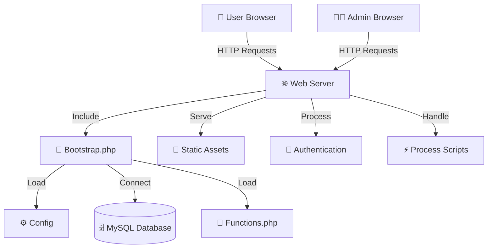

# AuraEdition 🚗✨

[](https://opensource.org/licenses/MIT)
[](https://www.php.net/)
[](https://www.mysql.com/)
[](https://tailwindcss.com/)

> **A premium e-commerce platform for luxury vehicles.**
> 
> Modern, secure, and scalable. Built for car enthusiasts, dealers, and admins.

---

## 🌟 Features

### 🛒 E-commerce Core
- **Product Catalog**: Luxury vehicle listings with search, filters, and pagination
- **Shopping Cart**: Add/remove items, quantity management, cart persistence
- **Wishlist**: Save favorite vehicles for later
- **Checkout System**: Secure payment processing with order management
- **Order History**: Track purchases and order status

### 👤 User Management
- **Authentication**: Secure registration, login, and password reset
- **User Profiles**: Account management with address storage
- **Role-Based Access**: User and admin roles with appropriate permissions

### 🎛️ Admin Panel
- **Dashboard Analytics**: Revenue tracking, sales charts, key metrics
- **Product Management**: Add, edit, delete vehicles with image uploads
- **Category Management**: Manage vehicle makes and models
- **Order Management**: View, update, and track all orders
- **User Management**: Administer user accounts and roles

### 🎨 User Experience
- **Responsive Design**: Mobile-first approach with Tailwind CSS
- **Modern UI**: Luxury aesthetic with premium styling
- **Interactive Elements**: AJAX-powered features for smooth UX
- **Search & Filters**: Advanced vehicle discovery

### 🔒 Security Features
- **CSRF Protection**: Token-based form security
- **Input Validation**: Comprehensive data sanitization
- **Password Security**: Bcrypt hashing with salt
- **Session Management**: Secure user sessions
- **SQL Injection Prevention**: Prepared statements throughout

---

## 🏗️ System Architecture

### Technology Stack
- **Backend**: PHP 7.4+ with procedural programming
- **Database**: MySQL 5.7+ with InnoDB engine
- **Frontend**: HTML5, CSS3, JavaScript (ES6+)
- **Styling**: Tailwind CSS for utility-first design
- **Icons**: Font Awesome for UI elements
- **Charts**: Chart.js for admin analytics

### Application Structure
```
AuraEdition/
├── 📁 admin/              # Admin panel (dashboard, management)
├── 📁 assets/             # Static resources (CSS, JS, images, fonts)
├── 📁 auth/               # Authentication system
├── 📁 config/             # Configuration files
├── 📁 docs/               # Comprehensive documentation
├── 📁 includes/           # Core PHP functions and helpers
├── 📁 pages/              # User-facing pages
├── 📁 process/            # Form handlers and AJAX endpoints
├── 📁 products/           # Product listings and details
├── 📁 templates/          # Reusable UI components
└── 📄 index.php           # Main entry point
```

### Data Flow Architecture


---

## 🚀 Quick Start Guide

### Prerequisites
- **Web Server**: Apache/Nginx with PHP support
- **PHP**: 7.4 or higher with mysqli extension
- **MySQL**: 5.7 or higher
- **Node.js**: 14+ (for Tailwind CSS compilation)
- **Composer**: (optional, for dependency management)

### Installation Steps

1. **Clone the Repository**
   ```bash
   git clone https://github.com/yourusername/auraedition.git
   cd auraedition
   ```

2. **Install Dependencies**
   ```bash
   # Install Node.js dependencies for Tailwind CSS
   npm install
   
   # Build Tailwind CSS
   npx tailwindcss -i ./assets/css/input.css -o ./assets/css/tailwind-output.css --minify
   ```

3. **Configure Database**
   ```bash
   # Create database
   mysql -u root -p
   CREATE DATABASE auraedition;
   
   # Import schema (if available)
   mysql -u root -p auraedition < database/schema.sql
   ```

4. **Configure Application**
   ```bash
   # Edit database configuration
   nano config/config.php
   
   # Update these values:
   define('DB_HOST', 'localhost');
   define('DB_USER', 'your_username');
   define('DB_PASS', 'your_password');
   define('DB_NAME', 'auraedition');
   ```

5. **Set Permissions**
   ```bash
   # Ensure upload directories are writable
   chmod 755 products/img/
   chmod 755 admin/assets/images/
   ```

6. **Start Development Server**
   ```bash
   # Using PHP built-in server
   php -S localhost:8000
   
   # Or configure your web server (Apache/Nginx)
   ```

### Environment Configuration

The application uses a centralized configuration system:

- **`config/config.php`**: Database credentials, paths, and constants
- **`includes/bootstrap.php`**: Application initialization and dependencies
- **Error Logging**: Check `error_log.txt` for debugging

---

## 📚 Documentation Index

### Core Documentation
- **[Architecture Guide](docs/architecture.md)**: System design, data flow, and component interactions
- **[Database Schema](docs/database.md)**: Table structures, relationships, and optimization
- **[Security Model](docs/security.md)**: Authentication, validation, and security practices
- **[Developer Guide](docs/developer_guide.md)**: Coding standards, workflow, and troubleshooting

### Module Documentation
- **[Modules Overview](docs/modules.md)**: Directory structure and purpose of each module
- **[API Planning](docs/api.md)**: Future REST API endpoints and integration

### Quick References
- **File Structure**: See project layout above
- **Database Tables**: See `docs/database.md`
- **Function Reference**: See `includes/functions.php` and `admin/includes/adminFunctions.php`

---

## 🔧 Development Workflow

### Adding New Features

1. **Database Changes**
   ```sql
   -- Add new tables/columns
   ALTER TABLE vehicles ADD COLUMN new_field VARCHAR(255);
   ```

2. **Backend Functions**
   ```php
   // Add to includes/functions.php or admin/includes/adminFunctions.php
   function newFeature($connection, $params) {
       // Implementation
   }
   ```

3. **Frontend Integration**
   ```php
   // Create new page in pages/ or admin/pages/
   // Add process script in process/ or admin/process/
   ```

4. **Styling**
   ```css
   /* Use Tailwind CSS classes or add custom styles */
   .custom-class { /* styles */ }
   ```

### Code Standards

- **PHP**: PSR-12 coding standards
- **SQL**: Use prepared statements, avoid raw queries
- **Security**: Validate all inputs, sanitize outputs
- **Performance**: Optimize database queries, use indexes

---

## 🛠️ Troubleshooting

### Common Issues

1. **Database Connection Error**
   - Check `config/config.php` credentials
   - Verify MySQL service is running
   - Check error logs in `error_log.txt`

2. **AJAX/JSON Errors**
   - Ensure process scripts return valid JSON
   - Check browser console for JavaScript errors
   - Verify CSRF tokens on forms

3. **Image Upload Issues**
   - Check directory permissions (755)
   - Verify file size limits in PHP config
   - Check allowed file types

4. **Styling Problems**
   - Rebuild Tailwind CSS: `npx tailwindcss -i ./assets/css/input.css -o ./assets/css/tailwind-output.css --minify`
   - Clear browser cache
   - Check CSS file paths

### Debug Mode

Enable detailed error reporting in development:
```php
// Add to config/config.php for development
error_reporting(E_ALL);
ini_set('display_errors', 1);
```

---

## 🔒 Security Considerations

### Production Deployment

1. **Environment Variables**
   - Move sensitive data to environment variables
   - Use `.env` files (not committed to git)

2. **HTTPS Enforcement**
   - Configure SSL certificates
   - Redirect HTTP to HTTPS

3. **File Permissions**
   - Restrict access to sensitive directories
   - Set appropriate file permissions

4. **Database Security**
   - Use dedicated database user with minimal privileges
   - Regular backups and monitoring

---

## 🤝 Contributing

We welcome contributions! Please follow these guidelines:

1. **Fork the repository**
2. **Create a feature branch**: `git checkout -b feature/AmazingFeature`
3. **Follow coding standards**: PSR-12 for PHP, consistent formatting
4. **Test thoroughly**: Ensure all functionality works
5. **Document changes**: Update relevant documentation
6. **Submit pull request**: With clear description of changes

### Development Setup

```bash
# Fork and clone
git clone https://github.com/yourusername/auraedition.git
cd auraedition

# Create development branch
git checkout -b feature/your-feature

# Make changes and test
# ...

# Commit with descriptive message
git commit -m "Add new feature: description"

# Push and create pull request
git push origin feature/your-feature
```

---

## 📄 License

This project is licensed under the MIT License - see the [LICENSE](LICENSE) file for details.

---

## 📞 Support & Contact

- **Email**: contact@auraedition.com
- **Website**: https://auraedition.com
- **Documentation**: [docs/](docs/) directory
- **Issues**: GitHub Issues for bug reports and feature requests

---

<div align="center">
  <p>Made with ❤️ by the AuraEdition Team</p>
  <p><em>Driving the future of luxury vehicle commerce</em></p>
</div>
