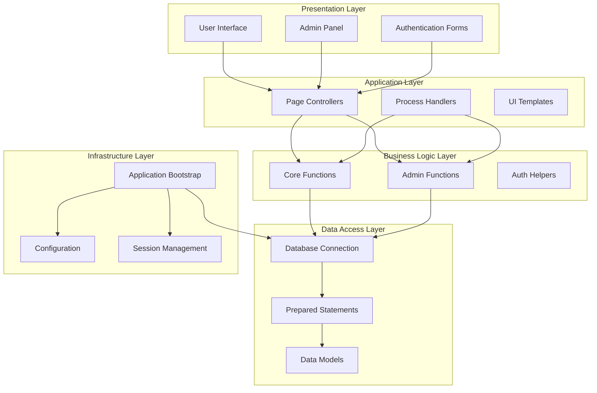
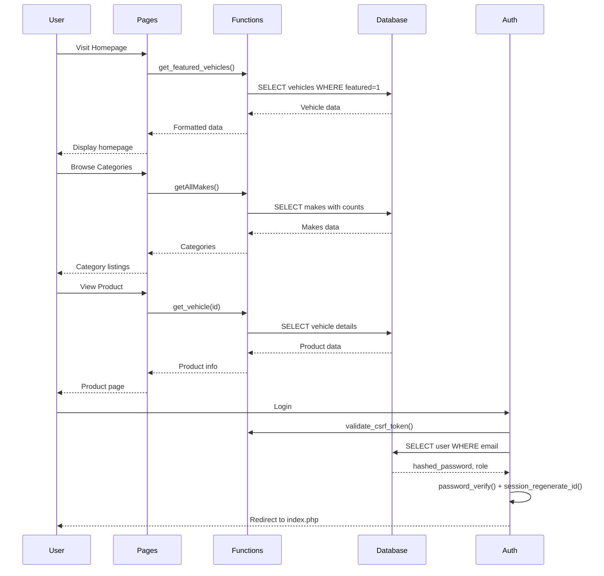
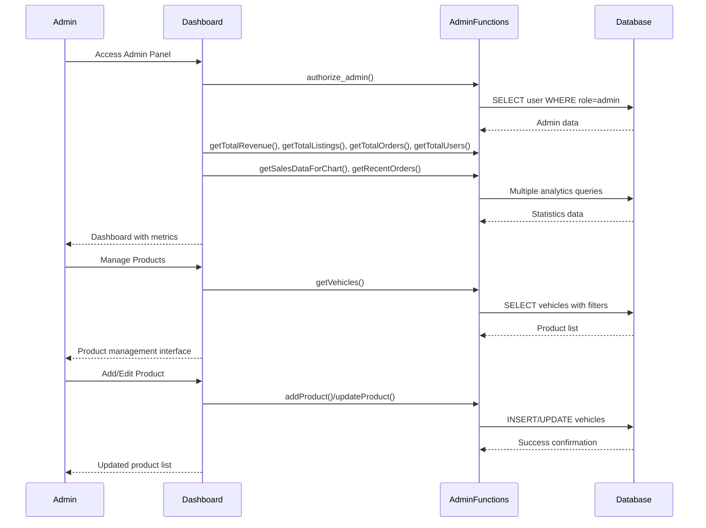
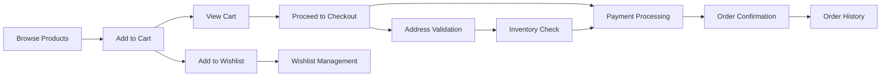
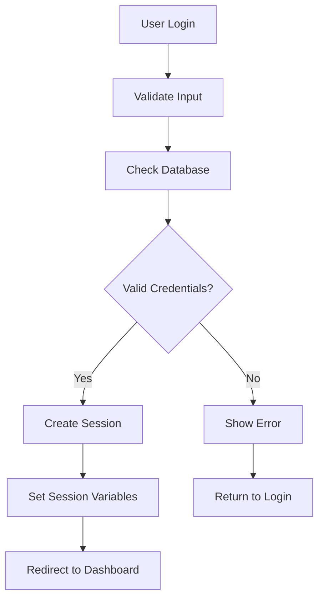

# AuraEdition Architecture & System Design

## 🏗️ System Overview

AuraEdition is a modular PHP web application designed for luxury vehicle e-commerce. The system follows a **procedural PHP architecture** with clear separation of concerns, emphasizing security, maintainability, and scalability.

### Core Design Principles

- **Separation of Concerns**: Clear boundaries between presentation, business logic, and data access
- **Security First**: Comprehensive input validation, CSRF protection, and SQL injection prevention
- **Modular Design**: Reusable components and functions across the application
- **Performance Optimized**: Efficient database queries and caching strategies
- **User Experience**: Responsive design with AJAX-powered interactions

---

## 🏛️ High-Level Architecture

### Technology Stack
```
┌─────────────────┐    ┌─────────────────┐    ┌─────────────────┐
│   Frontend      │    │   Backend       │    │   Database      │
│                 │    │                 │    │                 │
│ • HTML5         │◄──►│ • PHP 7.4+      │◄──►│ • MySQL 8.x     │
│ • CSS3          │    │ • Procedural    │    │   (tested 8.4)  │
│ • JavaScript    │    │ • mysqli        │    │ • InnoDB Engine │
│ • Tailwind CSS 4│    │ • Sessions      │    │ • utf8mb4       │
│ • Font Awesome  │    │ • CSRF Tokens   │    │                 │
└─────────────────┘    └─────────────────┘    └─────────────────┘

Server-side integrations bundled in-tree: PHPMailer (`includes/PHPMailer/`, SMTP email for
password reset) and the PayHere JS SDK loaded from payhere.lk (checkout payment).
```

### Application Layers



---

## 📁 Directory Structure & Responsibilities

### Core Directories

#### `includes/` - Foundation Layer
**Purpose**: Core application infrastructure and utilities

**Key Files**:
- `bootstrap.php`: Application initialization and dependency loading
- `db.php`: Database connection and configuration
- `functions.php`: Core business logic functions
- `session.php`: Session management and security
- `auth_helpers.php`: Authentication utilities
- `flash_messages.php`: User feedback system

**Responsibilities**:
- Database connectivity and query execution
- Session management and security
- Core business logic implementation
- Authentication and authorization
- Error handling and logging

#### `config/` - Configuration Layer
**Purpose**: Centralized configuration management

**Key Files**:
- `config.php`: Database credentials, paths, and constants

**Responsibilities**:
- Environment-specific settings
- Database connection parameters
- Application constants and paths
- Security configurations

#### `auth/` - Authentication Module
**Purpose**: User authentication and account management

**Key Files**:
- `login.php`, `register.php`: Authentication forms
- `loginProcess.php`, `registerProcess.php`: Form handlers
- `forgot_password.php`, `reset_password.php`: Password recovery
- `logout.php`: Session termination

**Responsibilities**:
- User registration and login
- Password reset functionality
- Session management
- Security validation

#### `admin/` - Administration Module
**Purpose**: Administrative interface and management tools

**Structure**:
```
admin/
├── dashboard.php          # Main admin dashboard
├── includes/              # Admin-specific helpers
│   ├── adminFunctions.php # Admin business logic
│   ├── adminHeader.php    # Admin layout header
│   └── adminSidebar.php   # Navigation sidebar
├── pages/                 # Admin page controllers
│   ├── addProduct.php     # Product management
│   ├── categories.php     # Category management
│   ├── orders.php         # Order management
│   └── users.php          # User management
├── process/               # Admin form handlers
└── assets/                # Admin-specific resources
```

**Responsibilities**:
- Product and inventory management
- User account administration
- Order processing and tracking
- Analytics and reporting
- Category and model management

#### `pages/` - User Interface Module
**Purpose**: User-facing pages and interfaces

**Key Files**:
- `categories.php`: Vehicle category browsing
- `cart.php`: Shopping cart interface
- `checkout.php`: Purchase completion
- `account.php`: User profile management
- `wishlist.php`: Saved items interface

**Responsibilities**:
- User interface presentation
- Data display and formatting
- User interaction handling
- Navigation and routing

#### `process/` - Action Handlers Module
**Purpose**: Form processing and AJAX endpoints

**Key Files**:
- `addToCartProcess.php`: Cart management
- `purchaseProcess.php`: Order processing
- `contactProcess.php`: Contact form handling
- `updateAccount.php`: Profile updates

**Responsibilities**:
- Form data processing
- AJAX request handling
- Database operations
- Response generation

#### `products/` - Product Module
**Purpose**: Product display and management

**Key Files**:
- `listings.php`: Product catalog
- `productDetails.php`: Individual product pages
- `img/`: Product image storage

**Responsibilities**:
- Product information display
- Image management
- Product search and filtering
- Inventory display

---

## 🔄 Data Flow Architecture

### User Journey Flow



### Admin Workflow



### E-commerce Flow



---

## 🔧 Component Interactions

### Bootstrap Process

```php
// includes/bootstrap.php - Application Initialization
1. Set timezone (UTC)
2. Start session management
3. Load configuration (config/config.php)
4. Establish database connection (includes/db.php)
5. Load helper functions (includes/auth_helpers.php)
```

### Function Organization

#### Core Functions (`includes/functions.php`)
- **Product Functions**: `get_featured_vehicles()`, `get_vehicle()`, `getAllMakes()`
- **Cart Functions**: `addToCart()`, `getCartItemsByUserId()`, `removeFromCart()`
- **Order Functions**: `fetchOrdersByUserId()`, `getOrderItemsByOrderId()`
- **User Functions**: `getUserWithAddress()`, `hasUserAddresses()`
- **Category Functions**: `addMake()`, `addModel()`, `deleteMake()`, `deleteModel()`

#### Admin Functions (`admin/includes/adminFunctions.php`)
- **Dashboard Functions**: `getTotalRevenue()`, `getSalesDataForChart()`
- **Product Management**: `addProduct()`, `updateProduct()`, `deleteProduct()`
- **User Management**: `getAllUsers()`, `toggleUserRole()`, `deleteUser()`
- **Order Management**: `getAllOrders()`, `getRecentOrders()`

### Database Interaction Pattern

```php
// Standard Database Query Pattern
function exampleFunction($connection, $params) {
    $sql = "SELECT * FROM table WHERE condition = ?";
    $stmt = $connection->prepare($sql);
    
    if ($stmt) {
        $stmt->bind_param("s", $params);
        $stmt->execute();
        $result = $stmt->get_result();
        $data = $result->fetch_all(MYSQLI_ASSOC);
        $stmt->close();
        return $data;
    }
    
    return [];
}
```

---

## 🔒 Security Architecture

### Authentication Flow



### Security Measures

1. **Input Validation**
   - All user inputs are validated and sanitized
   - Type checking and length validation
   - SQL injection prevention through prepared statements

2. **Session Security**
   - Secure session configuration
   - Session timeout and regeneration
   - CSRF token protection on all forms

3. **Password Security**
   - Bcrypt hashing with salt
   - Password strength requirements
   - Secure password reset process

4. **Access Control**
   - Role-based authorization
   - Admin-only route protection
   - Function-level permission checks

---

## 📊 Performance Considerations

### Database Optimization

1. **Indexing Strategy**
   - Primary keys on all tables
   - Indexes on foreign-key columns (see `docs/database.md` for the exact list)
   - No indexes on `status`, `is_featured`, or `price` - table scans on those filters are
     acceptable at current data volumes

2. **Query Optimization**
   - Prepared statements for all queries
   - Pagination via `LIMIT ? OFFSET ?` driven by page-size constants in callers

3. **Caching**
   - There is no caching layer: no query-result cache, no opcode hints, nothing beyond
     browser caching of static assets. Don't assume cached reads when reasoning about
     consistency.

### Frontend Performance

1. **Asset Optimization**
   - Tailwind CSS is minified at build time (`tailwind-output.css`, `--minify` flag)
   - JavaScript is plain and unminified (`assets/js/script.js`)
   - Third-party libs load from CDNs (PayHere SDK, Font Awesome, Chart.js)

2. **AJAX Implementation**
   - Cart/wishlist/category interactions POST to `process/*.php` endpoints
   - Response formats vary per handler - see [api.md](api.md) before writing client code

---

## 🔄 Extension Points

### Adding New Features

1. **Database Layer**
   ```sql
   -- Add new tables or columns
   CREATE TABLE new_feature (
       id INT AUTO_INCREMENT PRIMARY KEY,
       name VARCHAR(255),
       created_at TIMESTAMP DEFAULT CURRENT_TIMESTAMP
   );
   ```

2. **Function Layer**
   ```php
   // Add to includes/functions.php
   function newFeature($connection, $params) {
       // Implementation with prepared statements
   }
   ```

3. **Presentation Layer**
   ```php
   // Create new page in pages/
   // Add process script in process/
   // Update navigation if needed
   ```

### Module Integration

The modular architecture allows for easy integration of new features:

- **New Admin Pages**: Add to `admin/pages/`
- **New User Pages**: Add to `pages/`
- **New Process Handlers**: Add to `process/` or `admin/process/`
- **New Functions**: Add to appropriate functions file
- **New Templates**: Add to `templates/`

---

## 🚀 Deployment Architecture

- **Development**: local Apache (XAMPP) or `php -S ... -t <parent-dir>`; the hardcoded
  `/Projects/AuraEdition` path prefix dictates the directory layout. See
  [deployment.md](deployment.md).
- **Production**: any Apache + PHP + MySQL host; deployment is manual (no CI/CD, no build
  pipeline). See [deployment.md](deployment.md) for the steps and constraints.

---

This architecture provides a solid foundation for the AuraEdition platform, ensuring maintainability, security, and scalability while supporting future enhancements and integrations. 