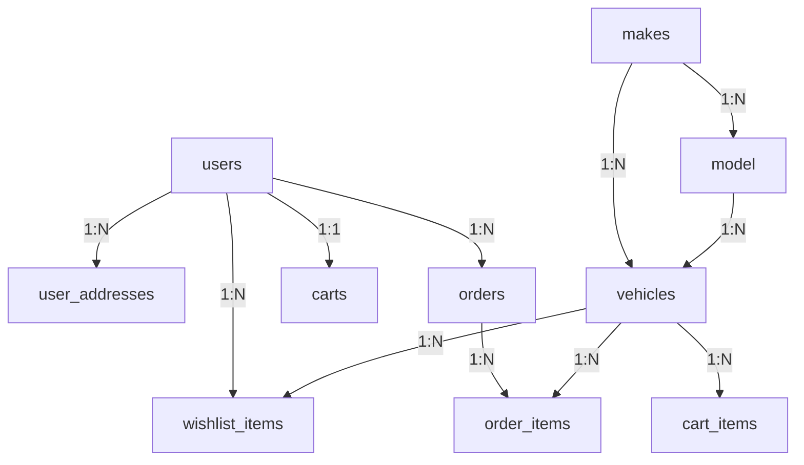

# Database Schema & Relationships

## Core Tables
- **users**: id, fname, lname, email, hashed_password, role, registerd_date
- **user_addresses**: address_user_id, address, city, state, country
- **vehicles**: id, title, description, price, stock, make_id, model_id, status, is_featured, is_popular, created_at
- **makes**: make_id, make_name, make_image
- **model**: model_id, model_name, model_make_id
- **orders**: order_id, user_id, total_price, orderd_at, status
- **order_items**: id, order_id, vehicle_id, price, quantity
- **cart_items**: cart_item_id, cart_id, vehicle_id, quantity
- **wishlist_items**: id, user_id, vehicle_id

## Relationships



## Indexing & Performance
- **Index all foreign keys:** user_id, make_id, model_id, order_id, vehicle_id, cart_id
- **Use `INNODB` engine** for foreign key support
- **Optimize queries** with `EXPLAIN` and add indexes as needed

## Example Table (users)
```sql
CREATE TABLE users (
  id INT AUTO_INCREMENT PRIMARY KEY,
  fname VARCHAR(50),
  lname VARCHAR(50),
  email VARCHAR(100) UNIQUE,
  hashed_password VARCHAR(255),
  role ENUM('user','admin') DEFAULT 'user',
  registerd_date DATETIME DEFAULT CURRENT_TIMESTAMP
);
``` 