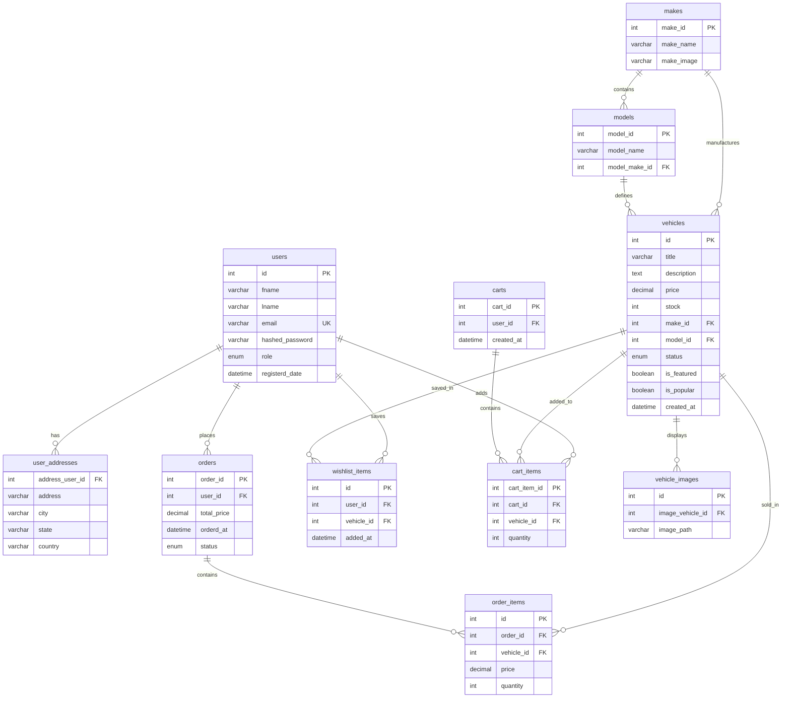
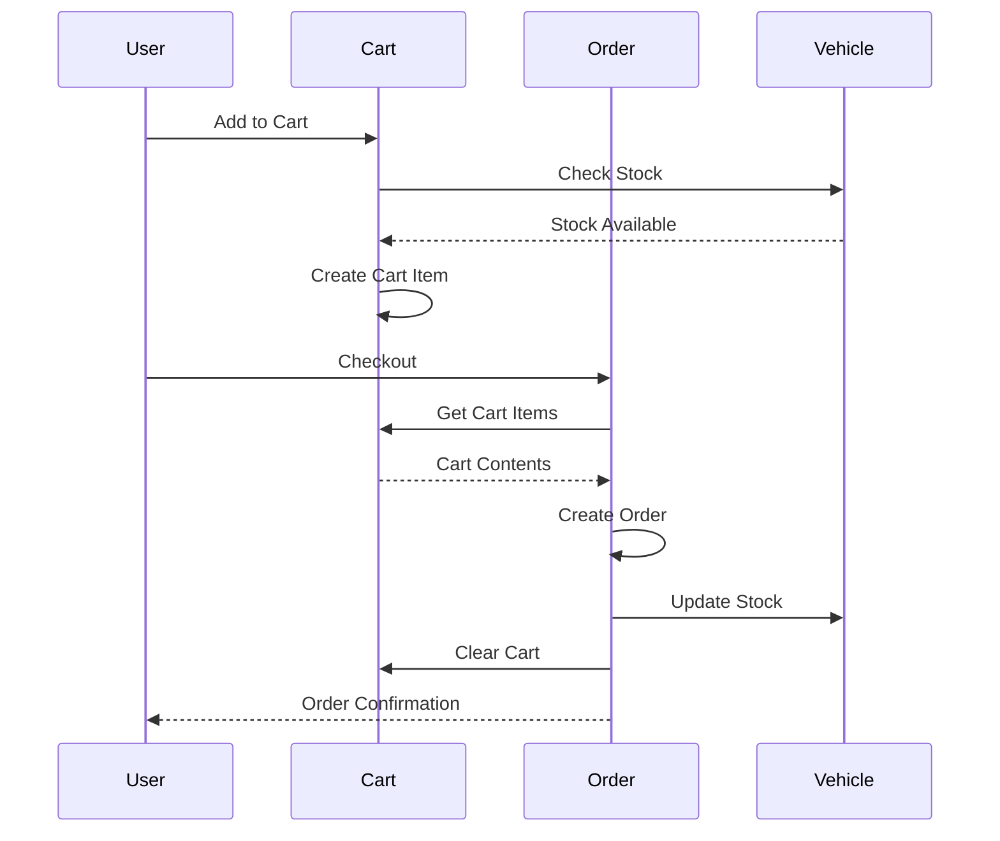
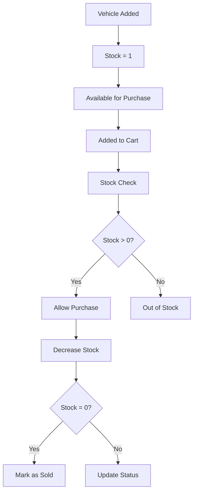

# AuraEdition Database Schema & Design

## 🗄️ Database Overview

The AuraEdition database is designed as a **relational MySQL database** using the InnoDB engine for ACID compliance and foreign key support. The schema is optimized for e-commerce operations with proper indexing and normalization.

### Database Characteristics
- **Engine**: InnoDB (ACID compliant)
- **Character Set**: UTF-8
- **Collation**: utf8mb4_unicode_ci
- **Version**: MySQL 5.7+
- **Connection**: mysqli with prepared statements

---

## 📊 Core Tables & Relationships

### Entity Relationship Diagram



---

## 📋 Detailed Table Schemas

### 1. Users Table
**Purpose**: Store user account information and authentication data

```sql
CREATE TABLE users (
    id INT AUTO_INCREMENT PRIMARY KEY,
    fname VARCHAR(50) NOT NULL,
    lname VARCHAR(50) NOT NULL,
    email VARCHAR(100) UNIQUE NOT NULL,
    hashed_password VARCHAR(255) NOT NULL,
    role ENUM('user', 'admin') DEFAULT 'user',
    registerd_date DATETIME DEFAULT CURRENT_TIMESTAMP,
    
    INDEX idx_email (email),
    INDEX idx_role (role),
    INDEX idx_registration_date (registerd_date)
);
```

**Key Features**:
- **Primary Key**: Auto-incrementing ID
- **Unique Constraint**: Email address
- **Role-based Access**: User/Admin enumeration
- **Security**: Bcrypt hashed passwords
- **Audit Trail**: Registration timestamp

### 2. User Addresses Table
**Purpose**: Store user shipping/billing addresses

```sql
CREATE TABLE user_addresses (
    address_user_id INT PRIMARY KEY,
    address VARCHAR(255) NOT NULL,
    city VARCHAR(100) NOT NULL,
    state VARCHAR(100) NOT NULL,
    country VARCHAR(100) DEFAULT 'USA',
    
    FOREIGN KEY (address_user_id) REFERENCES users(id) ON DELETE CASCADE
);
```

**Key Features**:
- **One-to-One Relationship**: Each user has one address
- **Cascade Delete**: Address removed when user is deleted
- **Flexible Structure**: Supports international addresses

### 3. Makes Table
**Purpose**: Store vehicle manufacturers/brands

```sql
CREATE TABLE makes (
    make_id INT AUTO_INCREMENT PRIMARY KEY,
    make_name VARCHAR(100) NOT NULL UNIQUE,
    make_image VARCHAR(255),
    
    INDEX idx_make_name (make_name)
);
```

**Key Features**:
- **Unique Names**: Prevents duplicate manufacturers
- **Image Support**: Brand logos and images
- **Performance**: Indexed for fast lookups

### 4. Models Table
**Purpose**: Store vehicle models within makes

```sql
CREATE TABLE models (
    model_id INT AUTO_INCREMENT PRIMARY KEY,
    model_name VARCHAR(100) NOT NULL,
    model_make_id INT NOT NULL,
    
    FOREIGN KEY (model_make_id) REFERENCES makes(make_id) ON DELETE CASCADE,
    UNIQUE KEY unique_model_per_make (model_name, model_make_id),
    INDEX idx_make_id (model_make_id),
    INDEX idx_model_name (model_name)
);
```

**Key Features**:
- **Hierarchical Structure**: Models belong to makes
- **Unique Constraint**: Model names unique within make
- **Cascade Delete**: Models removed when make is deleted

### 5. Vehicles Table
**Purpose**: Core product catalog for vehicles

```sql
CREATE TABLE vehicles (
    id INT AUTO_INCREMENT PRIMARY KEY,
    title VARCHAR(255) NOT NULL,
    description TEXT,
    price DECIMAL(10,2) NOT NULL,
    stock INT DEFAULT 1,
    make_id INT,
    model_id INT,
    status ENUM('ACTIVE', 'INACTIVE', 'SOLD') DEFAULT 'ACTIVE',
    is_featured BOOLEAN DEFAULT FALSE,
    is_popular BOOLEAN DEFAULT FALSE,
    created_at DATETIME DEFAULT CURRENT_TIMESTAMP,
    
    FOREIGN KEY (make_id) REFERENCES makes(make_id) ON DELETE SET NULL,
    FOREIGN KEY (model_id) REFERENCES models(model_id) ON DELETE SET NULL,
    
    INDEX idx_status (status),
    INDEX idx_featured (is_featured),
    INDEX idx_popular (is_popular),
    INDEX idx_created_at (created_at),
    INDEX idx_price (price),
    INDEX idx_make_model (make_id, model_id)
);
```

**Key Features**:
- **Product Management**: Complete vehicle information
- **Status Tracking**: Active, inactive, or sold
- **Featured/Popular**: Marketing flags for homepage
- **Inventory**: Stock quantity tracking
- **Performance**: Multiple indexes for common queries

### 6. Vehicle Images Table
**Purpose**: Store multiple images per vehicle

```sql
CREATE TABLE vehicle_images (
    id INT AUTO_INCREMENT PRIMARY KEY,
    image_vehicle_id INT NOT NULL,
    image_path VARCHAR(255) NOT NULL,
    
    FOREIGN KEY (image_vehicle_id) REFERENCES vehicles(id) ON DELETE CASCADE,
    INDEX idx_vehicle_id (image_vehicle_id)
);
```

**Key Features**:
- **Multiple Images**: One vehicle can have many images
- **Cascade Delete**: Images removed when vehicle is deleted
- **File Path Storage**: Flexible image storage system

### 7. Orders Table
**Purpose**: Store customer orders and transactions

```sql
CREATE TABLE orders (
    order_id INT AUTO_INCREMENT PRIMARY KEY,
    user_id INT NOT NULL,
    total_price DECIMAL(10,2) NOT NULL,
    orderd_at DATETIME DEFAULT CURRENT_TIMESTAMP,
    status ENUM('pending', 'processing', 'shipped', 'delivered', 'cancelled') DEFAULT 'pending',
    
    FOREIGN KEY (user_id) REFERENCES users(id) ON DELETE CASCADE,
    
    INDEX idx_user_id (user_id),
    INDEX idx_status (status),
    INDEX idx_order_date (orderd_at)
);
```

**Key Features**:
- **Order Tracking**: Complete order lifecycle
- **Status Management**: Multiple order states
- **Audit Trail**: Order timestamp
- **User Association**: Links to customer

### 8. Order Items Table
**Purpose**: Store individual items within orders

```sql
CREATE TABLE order_items (
    id INT AUTO_INCREMENT PRIMARY KEY,
    order_id INT NOT NULL,
    vehicle_id INT NOT NULL,
    price DECIMAL(10,2) NOT NULL,
    quantity INT DEFAULT 1,
    
    FOREIGN KEY (order_id) REFERENCES orders(order_id) ON DELETE CASCADE,
    FOREIGN KEY (vehicle_id) REFERENCES vehicles(id) ON DELETE RESTRICT,
    
    INDEX idx_order_id (order_id),
    INDEX idx_vehicle_id (vehicle_id)
);
```

**Key Features**:
- **Order Details**: Individual items in orders
- **Price Snapshot**: Price at time of purchase
- **Quantity Support**: Multiple units per item
- **Data Integrity**: Prevents vehicle deletion if in orders

### 9. Carts Table
**Purpose**: Store user shopping carts

```sql
CREATE TABLE carts (
    cart_id INT AUTO_INCREMENT PRIMARY KEY,
    user_id INT NOT NULL UNIQUE,
    created_at DATETIME DEFAULT CURRENT_TIMESTAMP,
    
    FOREIGN KEY (user_id) REFERENCES users(id) ON DELETE CASCADE,
    
    INDEX idx_user_id (user_id)
);
```

**Key Features**:
- **One Cart Per User**: Unique constraint on user_id
- **Session Persistence**: Cart survives browser sessions
- **Automatic Cleanup**: Cart removed when user is deleted

### 10. Cart Items Table
**Purpose**: Store items in user shopping carts

```sql
CREATE TABLE cart_items (
    cart_item_id INT AUTO_INCREMENT PRIMARY KEY,
    cart_id INT NOT NULL,
    vehicle_id INT NOT NULL,
    quantity INT DEFAULT 1,
    
    FOREIGN KEY (cart_id) REFERENCES carts(cart_id) ON DELETE CASCADE,
    FOREIGN KEY (vehicle_id) REFERENCES vehicles(id) ON DELETE CASCADE,
    
    INDEX idx_cart_id (cart_id),
    INDEX idx_vehicle_id (vehicle_id)
);
```

**Key Features**:
- **Cart Management**: Items in shopping cart
- **Quantity Support**: Multiple units per item
- **Cascade Delete**: Items removed when cart or vehicle is deleted

### 11. Wishlist Items Table
**Purpose**: Store user saved/favorite vehicles

```sql
CREATE TABLE wishlist_items (
    id INT AUTO_INCREMENT PRIMARY KEY,
    user_id INT NOT NULL,
    vehicle_id INT NOT NULL,
    added_at DATETIME DEFAULT CURRENT_TIMESTAMP,
    
    FOREIGN KEY (user_id) REFERENCES users(id) ON DELETE CASCADE,
    FOREIGN KEY (vehicle_id) REFERENCES vehicles(id) ON DELETE CASCADE,
    
    UNIQUE KEY unique_user_vehicle (user_id, vehicle_id),
    INDEX idx_user_id (user_id),
    INDEX idx_vehicle_id (vehicle_id)
);
```

**Key Features**:
- **Wishlist Management**: User saved vehicles
- **Unique Constraint**: Prevents duplicate saves
- **Timestamp**: When item was added
- **Cascade Delete**: Items removed when user or vehicle is deleted

---

## 🔍 Query Patterns & Optimization

### Common Query Patterns

#### 1. Featured Vehicles Query
```sql
-- Get featured vehicles with images
SELECT v.id, v.title, v.price, v.description,
       COALESCE(vi.image_path, '/default.jpg') as image_url
FROM vehicles v
LEFT JOIN vehicle_images vi ON v.id = vi.image_vehicle_id
WHERE v.is_featured = 1 AND v.status = 'ACTIVE'
ORDER BY v.created_at DESC
LIMIT 6;
```

#### 2. Category Browsing Query
```sql
-- Get makes with vehicle counts
SELECT m.make_id, m.make_name, m.make_image,
       COUNT(v.id) as listings_count
FROM makes m
LEFT JOIN vehicles v ON m.make_id = v.make_id AND v.status = 'ACTIVE'
GROUP BY m.make_id, m.make_name, m.make_image
ORDER BY listings_count DESC;
```

#### 3. User Cart Query
```sql
-- Get user's cart items with vehicle details
SELECT ci.cart_item_id, ci.quantity,
       v.id as vehicle_id, v.title, v.price,
       COALESCE(vi.image_path, '/default.jpg') as image_url
FROM cart_items ci
JOIN vehicles v ON ci.vehicle_id = v.id
LEFT JOIN vehicle_images vi ON v.id = vi.image_vehicle_id
JOIN carts c ON ci.cart_id = c.cart_id
WHERE c.user_id = ? AND v.status = 'ACTIVE';
```

#### 4. Order History Query
```sql
-- Get user's order history with items
SELECT o.order_id, o.total_price, o.orderd_at, o.status,
       oi.vehicle_id, oi.price as item_price, oi.quantity,
       v.title as vehicle_title
FROM orders o
JOIN order_items oi ON o.order_id = oi.order_id
JOIN vehicles v ON oi.vehicle_id = v.id
WHERE o.user_id = ?
ORDER BY o.orderd_at DESC;
```

### Indexing Strategy

#### Primary Indexes
- **Primary Keys**: All tables have auto-incrementing primary keys
- **Foreign Keys**: Indexed for join performance
- **Unique Constraints**: Email, model names, wishlist items

#### Performance Indexes
```sql
-- Composite indexes for common query patterns
CREATE INDEX idx_vehicle_status_featured ON vehicles(status, is_featured);
CREATE INDEX idx_vehicle_status_popular ON vehicles(status, is_popular);
CREATE INDEX idx_vehicle_make_status ON vehicles(make_id, status);
CREATE INDEX idx_order_user_status ON orders(user_id, status);
CREATE INDEX idx_cart_user_vehicle ON cart_items(cart_id, vehicle_id);
```

#### Query Optimization Tips
1. **Use Prepared Statements**: All queries use prepared statements for security and performance
2. **Limit Results**: Use LIMIT clauses for pagination
3. **Selective Columns**: Only select needed columns
4. **Efficient Joins**: Use appropriate JOIN types (INNER vs LEFT)
5. **Index Usage**: Ensure queries use indexed columns

---

## 🔄 Data Flow Patterns

### E-commerce Transaction Flow



### Inventory Management Flow



---

## 🛡️ Data Integrity & Constraints

### Foreign Key Constraints
- **Cascade Delete**: User deletion removes addresses, orders, cart, wishlist
- **Restrict Delete**: Vehicles cannot be deleted if in orders
- **Set Null**: Make/model deletion sets vehicle references to NULL

### Data Validation
- **Email Format**: Valid email addresses only
- **Price Range**: Positive decimal values
- **Stock Quantity**: Non-negative integers
- **Status Values**: Enumerated status options only

### Transaction Management
```php
// Example transaction for order processing
function processOrder($connection, $user_id, $cart_items) {
    $connection->begin_transaction();
    
    try {
        // Create order
        $order_id = createOrder($connection, $user_id, $total);
        
        // Add order items
        foreach ($cart_items as $item) {
            addOrderItem($connection, $order_id, $item);
            updateVehicleStock($connection, $item['vehicle_id'], -$item['quantity']);
        }
        
        // Clear cart
        clearUserCart($connection, $user_id);
        
        $connection->commit();
        return $order_id;
    } catch (Exception $e) {
        $connection->rollback();
        throw $e;
    }
}
```

---

## 📈 Performance Monitoring

### Key Performance Indicators
1. **Query Response Time**: Monitor slow queries
2. **Index Usage**: Ensure indexes are being used
3. **Connection Pool**: Monitor database connections
4. **Lock Contention**: Watch for table locks

### Optimization Recommendations
1. **Regular Maintenance**: Analyze and optimize tables
2. **Query Caching**: Cache frequently accessed data
3. **Connection Pooling**: Reuse database connections
4. **Read Replicas**: Use for heavy read operations

---

## 🔧 Database Maintenance

### Backup Strategy
```bash
# Daily backup script
mysqldump -u username -p auraedition > backup_$(date +%Y%m%d).sql

# Restore from backup
mysql -u username -p auraedition < backup_20231201.sql
```

### Maintenance Queries
```sql
-- Analyze table performance
ANALYZE TABLE vehicles, orders, users;

-- Optimize table structure
OPTIMIZE TABLE vehicles, orders, users;

-- Check table status
SHOW TABLE STATUS LIKE 'vehicles';
```

---

This comprehensive database design ensures data integrity, performance, and scalability while supporting all e-commerce functionality of the AuraEdition platform. 