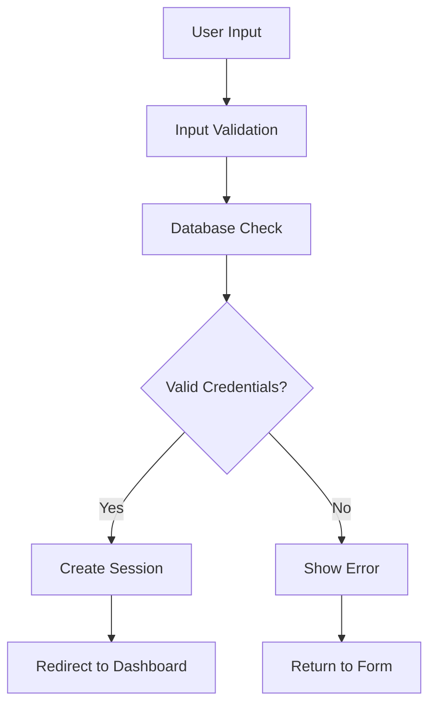
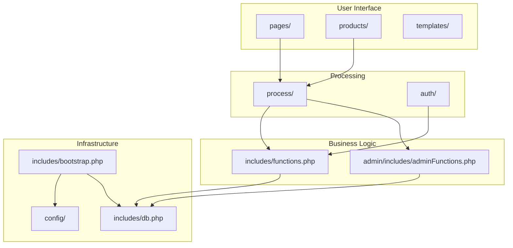

# AuraEdition Modules & Directory Guide

## 📁 Project Structure Overview

AuraEdition follows a **modular architecture** with clear separation of concerns. Each directory serves a specific purpose and contains related functionality. This guide explains the purpose, key files, and responsibilities of each module.

---

## 🏗️ Core Infrastructure Modules

### `config/` - Configuration Management
**Purpose**: Centralized configuration and environment settings

**Key Files**:
- `config.php`: Database credentials, application constants, and paths

**Responsibilities**:
- Database connection parameters
- Application constants and base URLs
- Environment-specific settings
- Security configurations

**Usage Pattern**:
```php
// All configuration is loaded via bootstrap.php
include_once $_SERVER['DOCUMENT_ROOT'] . '/Projects/AuraEdition/config/config.php';

// Access configuration constants
$db_host = DB_HOST;
$base_url = BASE_URL;
```

### `includes/` - Core Application Foundation
**Purpose**: Core PHP functions, database connectivity, and application infrastructure

**Key Files**:
- `bootstrap.php`: Application initialization and dependency loading
- `db.php`: Database connection and mysqli configuration
- `functions.php`: Core business logic functions (655 lines)
- `session.php`: Session management and security
- `auth_helpers.php`: Authentication utilities
- `flash_messages.php`: User feedback system
- `header.php`: Common HTML head section
- `footer.php`: Common HTML footer
- `navbar.php`: Navigation component
- `filterBar.php`: Search and filter interface

**Responsibilities**:
- Database connectivity and query execution
- Session management and security
- Core business logic implementation
- Authentication and authorization
- Error handling and logging
- Common UI components

**Function Categories**:
```php
// Product Functions
get_featured_vehicles(), get_vehicle(), getAllMakes(), getListingsByMake()

// Cart Functions  
addToCart(), getCartItemsByUserId(), removeFromCart(), clearCart()

// Order Functions
fetchOrdersByUserId(), getOrderItemsByOrderId()

// User Functions
getUserWithAddress(), hasUserAddresses()

// Category Functions
addMake(), addModel(), deleteMake(), deleteModel()
```

---

## 🔐 Authentication Module

### `auth/` - User Authentication System
**Purpose**: Complete user authentication and account management

**Key Files**:
- `login.php`: User login form and interface
- `register.php`: User registration form
- `loginProcess.php`: Login form processing and validation
- `registerProcess.php`: Registration form processing
- `forgot_password.php`: Password reset request form
- `reset_password.php`: Password reset form
- `forgotPasswordProcess.php`: Password reset email processing
- `resetPasswordProcess.php`: Password reset processing
- `logout.php`: Session termination

**Responsibilities**:
- User registration and account creation
- Secure login and session management
- Password reset functionality
- Email-based account recovery
- Input validation and security

**Authentication Flow**:


---

## 🎛️ Administration Module

### `admin/` - Administrative Interface
**Purpose**: Complete admin panel for managing the e-commerce platform

**Structure**:
```
admin/
├── dashboard.php              # Main admin dashboard with analytics
├── includes/                  # Admin-specific helpers
│   ├── adminFunctions.php     # Admin business logic (548 lines)
│   ├── adminHeader.php        # Admin layout header
│   ├── adminFooter.php        # Admin layout footer
│   ├── adminNavbar.php        # Admin navigation bar
│   └── adminSidebar.php       # Admin sidebar navigation
├── pages/                     # Admin page controllers
│   ├── addProduct.php         # Add new vehicle form
│   ├── EditProduct.php        # Edit existing vehicle
│   ├── categories.php         # Manage makes and models
│   ├── orders.php             # Order management interface
│   ├── users.php              # User management interface
│   ├── vehicles.php           # Vehicle listing management
│   ├── adminAccount.php       # Admin account settings
│   └── get_models.php         # AJAX endpoint for model dropdown
├── process/                   # Admin form handlers
│   ├── addProductProcess.php  # Add vehicle processing
│   ├── editProductProcess.php # Edit vehicle processing
│   ├── deleteProductProcess.php # Delete vehicle processing
│   ├── addMakeProcess.php     # Add make processing
│   ├── addModelProcess.php    # Add model processing
│   ├── deleteMakeProcess.php  # Delete make processing
│   ├── deleteModelProcess.php # Delete model processing
│   ├── getModelsByMake.php    # AJAX model retrieval
│   ├── categoriesProcess.php  # Category management
│   └── accountProcess.php     # Admin account updates
├── assets/                    # Admin-specific resources
│   ├── css/adminStyles.css    # Admin styling
│   ├── js/adminScript.js      # Admin JavaScript (252 lines)
│   └── images/                # Admin images
└── templates/                 # Admin templates
    ├── admin_template.php     # Admin layout template
    ├── content_header.php     # Content header
    └── content_footer.php     # Content footer
```

**Key Features**:
- **Dashboard Analytics**: Revenue tracking, sales charts, key metrics
- **Product Management**: Add, edit, delete vehicles with image uploads
- **Category Management**: Manage vehicle makes and models
- **Order Management**: View, update, and track all orders
- **User Management**: Administer user accounts and roles
- **Inventory Control**: Stock management and status updates

**Admin Functions**:
```php
// Dashboard Functions
getTotalRevenue(), getTotalListings(), getTotalOrders(), getTotalUsers()
getSalesDataForChart(), getRecentOrders()

// Product Management
addProduct(), updateProduct(), deleteProduct(), uploadProductImage()
getProductInfo(), getVehicles()

// User Management
getAllUsers(), countAllUsers(), deleteUser(), toggleUserRole()

// Order Management
getAllOrders(), countAllOrders(), getRecentOrders()
```

---

## 👥 User Interface Modules

### `pages/` - User-Facing Pages
**Purpose**: User interface pages and customer-facing functionality

**Key Files**:
- `categories.php`: Vehicle category browsing and makes listing
- `cart.php`: Shopping cart interface and management
- `checkout.php`: Purchase completion and payment processing
- `account.php`: User profile management and settings
- `wishlist.php`: Saved items and favorites interface
- `about.php`: About page and company information
- `contact.php`: Contact form and information
- `makesListings.php`: Vehicle listings by make
- `purchasedHistory.php`: Order history and tracking
- `invoice.php`: Order confirmation and invoice display

**Responsibilities**:
- User interface presentation
- Data display and formatting
- User interaction handling
- Navigation and routing
- E-commerce user experience

### `products/` - Product Display Module
**Purpose**: Product catalog and individual product pages

**Key Files**:
- `listings.php`: Product catalog with search and filters
- `productDetails.php`: Individual product detail pages
- `img/`: Product image storage and management

**Responsibilities**:
- Product information display
- Image management and optimization
- Product search and filtering
- Inventory display
- Product categorization

---

## ⚡ Process Handlers Module

### `process/` - Form Processing & AJAX Endpoints
**Purpose**: Backend processing for forms and AJAX requests

**Key Files**:
- `addToCartProcess.php`: Add items to shopping cart
- `removeFromCartProcess.php`: Remove items from cart
- `updateCartQuantity.php`: Update cart item quantities
- `clearCartProcess.php`: Clear entire shopping cart
- `addToWishlistProcess.php`: Add items to wishlist
- `removeFromWishlistProcess.php`: Remove items from wishlist
- `purchaseProcess.php`: Complete purchase and create orders
- `cartCheckoutProcess.php`: Process checkout flow
- `buyNowProcess.php`: Direct purchase processing
- `contactProcess.php`: Contact form processing
- `updateAccount.php`: User profile updates
- `loginProcess.php`: Login form processing
- `registerProcess.php`: Registration form processing
- `logoutProcess.php`: Session termination

**Responsibilities**:
- Form data processing and validation
- AJAX request handling
- Database operations and transactions
- JSON response generation
- Security validation and CSRF protection

**Processing Pattern**:
```php
// Standard process script structure
<?php
include_once $_SERVER['DOCUMENT_ROOT'] . '/Projects/AuraEdition/includes/bootstrap.php';

// Validate request method
if ($_SERVER['REQUEST_METHOD'] !== 'POST') {
    header('Location: /Projects/AuraEdition/index.php');
    exit;
}

// Validate user authentication
if (!isset($_SESSION['user_id'])) {
    header('Location: /Projects/AuraEdition/auth/login.php');
    exit;
}

// Process the request
try {
    // Business logic here
    $result = processRequest($connection, $_POST);
    
    // Return success response
    header('Location: /Projects/AuraEdition/pages/success.php');
} catch (Exception $e) {
    // Handle errors
    $_SESSION['error'] = $e->getMessage();
    header('Location: /Projects/AuraEdition/pages/error.php');
}
?>
```

---

## 🎨 Presentation Modules

### `templates/` - Reusable UI Components
**Purpose**: Reusable HTML templates and UI components

**Key Files**:
- `template.php`: Main page layout template
- `card.php`: Product card component
- `makesCard.php`: Make category card component
- `pagination.php`: Pagination component
- `content_header.php`: Content area header
- `content_footer.php`: Content area footer

**Responsibilities**:
- Consistent UI components
- Reusable HTML structures
- Template inheritance
- Component modularity

### `assets/` - Static Resources
**Purpose**: CSS, JavaScript, images, fonts, and other static assets

**Structure**:
```
assets/
├── css/
│   ├── style.css              # Main application styles
│   └── tailwind.css           # Tailwind CSS framework
├── js/
│   └── script.js              # Main application JavaScript
├── images/                    # Application images
│   ├── hero-img.png           # Hero section image
│   ├── make-*.png             # Vehicle make logos
│   └── *.jpg                  # Other images
├── fonts/                     # Custom fonts
│   ├── Inter-VariableFont_opsz,wght.ttf
│   └── TrajanPro-Regular.ttf
└── video/
    └── hero.mp4               # Hero video
```

**Responsibilities**:
- Styling and visual design
- Client-side functionality
- Asset optimization
- Brand assets and media

---

## 📚 Documentation Module

### `docs/` - Comprehensive Documentation
**Purpose**: Complete project documentation and guides

**Key Files**:
- `README.docs.md`: Documentation index and overview
- `architecture.md`: System architecture and design patterns
- `database.md`: Database schema and relationships
- `modules.md`: This file - module explanations
- `security.md`: Security practices and implementation
- `developer_guide.md`: Development workflow and standards
- `api.md`: API planning and documentation

**Responsibilities**:
- Project documentation
- Development guides
- Architecture explanations
- Security guidelines
- API documentation

---

## 🔄 Module Interactions

### Data Flow Between Modules



### Common Integration Patterns

#### 1. Page Loading Pattern
```php
// Standard page structure
<?php
include_once $_SERVER['DOCUMENT_ROOT'] . '/Projects/AuraEdition/includes/bootstrap.php';
include_once $_SERVER['DOCUMENT_ROOT'] . '/Projects/AuraEdition/includes/functions.php';

// Page logic here
$data = getSomeData($connection);

// Include header
include_once $_SERVER['DOCUMENT_ROOT'] . '/Projects/AuraEdition/includes/header.php';
?>

<!-- Page content -->
<?php include_once $_SERVER['DOCUMENT_ROOT'] . '/Projects/AuraEdition/includes/footer.php'; ?>
```

#### 2. AJAX Processing Pattern
```php
// Standard AJAX endpoint
<?php
include_once $_SERVER['DOCUMENT_ROOT'] . '/Projects/AuraEdition/includes/bootstrap.php';

header('Content-Type: application/json');

// Validate request
if ($_SERVER['REQUEST_METHOD'] !== 'POST') {
    echo json_encode(['success' => false, 'message' => 'Invalid request']);
    exit;
}

// Process request
try {
    $result = processData($connection, $_POST);
    echo json_encode(['success' => true, 'data' => $result]);
} catch (Exception $e) {
    echo json_encode(['success' => false, 'message' => $e->getMessage()]);
}
?>
```

#### 3. Admin Page Pattern
```php
<?php
include_once $_SERVER['DOCUMENT_ROOT'] . '/Projects/AuraEdition/includes/bootstrap.php';
include_once $_SERVER['DOCUMENT_ROOT'] . '/Projects/AuraEdition/admin/includes/adminFunctions.php';

// Authorize admin access
$user = authorize_admin($connection);

// Get page data
$data = getAdminData($connection);

// Include admin template
include_once $_SERVER['DOCUMENT_ROOT'] . '/Projects/AuraEdition/admin/includes/adminHeader.php';
?>

<!-- Admin page content -->
<?php include_once $_SERVER['DOCUMENT_ROOT'] . '/Projects/AuraEdition/admin/includes/adminFooter.php'; ?>
```

---

## 🚀 Extension Points

### Adding New Features

#### 1. New User Page
```bash
# Create new page
touch pages/newFeature.php

# Add to navigation if needed
# Update includes/navbar.php
```

#### 2. New Admin Feature
```bash
# Create admin page
touch admin/pages/newAdminFeature.php

# Add process handler
touch admin/process/newAdminFeatureProcess.php

# Add to admin sidebar
# Update admin/includes/adminSidebar.php
```

#### 3. New Process Handler
```bash
# Create process script
touch process/newFeatureProcess.php

# Add JavaScript for AJAX calls
# Update assets/js/script.js
```

#### 4. New Function
```php
// Add to appropriate functions file
// includes/functions.php or admin/includes/adminFunctions.php

function newFeature($connection, $params) {
    // Implementation with prepared statements
    $sql = "SELECT * FROM table WHERE condition = ?";
    $stmt = $connection->prepare($sql);
    // ... implementation
}
```

---

## 🔧 Module Dependencies

### Core Dependencies
- **All modules** depend on `config/` and `includes/bootstrap.php`
- **Process scripts** depend on `includes/functions.php`
- **Admin modules** depend on `admin/includes/adminFunctions.php`
- **Pages** depend on `includes/` for common functions

### Module Independence
- **Authentication** (`auth/`) is self-contained
- **Admin panel** (`admin/`) has minimal external dependencies
- **Process handlers** (`process/`) are independent units
- **Pages** (`pages/`) are presentation-focused

---

This modular architecture provides clear separation of concerns, making the codebase maintainable, scalable, and easy to extend with new features. 